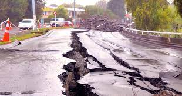
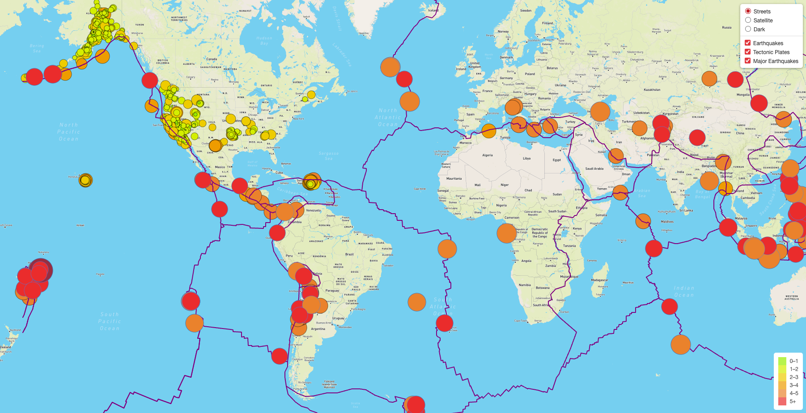
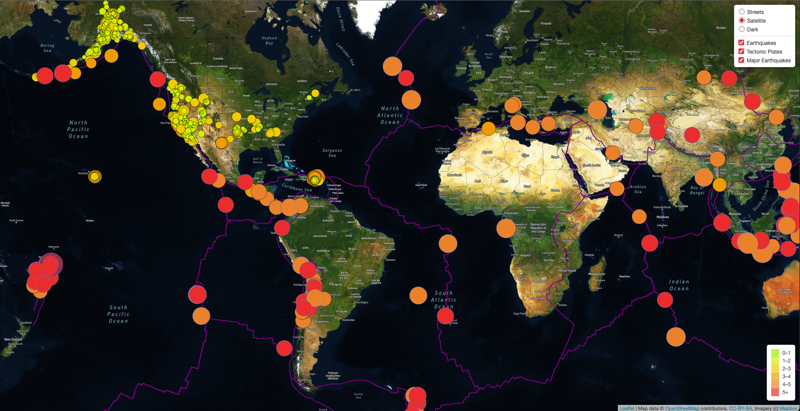
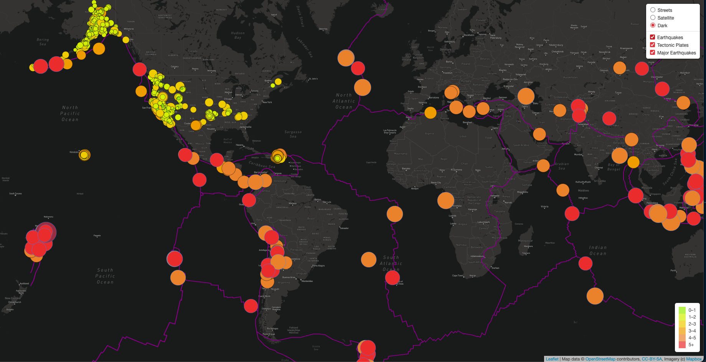
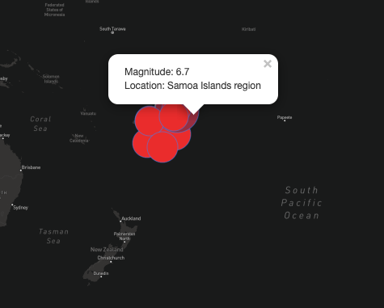

# Mapping_Earthquakes
Analyzing Earthquakes Around The World
 

Tyrone Fraley 
UC Berkley Extension 
Dec 9, 2022 

 

  

 

## Overview of the Analysis
The purpose of this analysis was to analyze earthquakes from around the world. To map the earthquakes I used Javascript to scrape data 
from Mapbox using a Mapbox api, the USGS data on earthquakes, and then plot the data using Leaflet. The data from the Javascript file was then pulled into my html file
to see the data displayed on a webpage. The data was then configured to display three different types of maps: Satellite, Dark, and Streets. 
These three maps could display three variables: Earthquakes, Tectonic Plates, and Major Earthquakes.  
 

## Procedures for Analysis
To start the analysis off on the right foot it was important to build the streets, satellite, and dark maps. Each was done by creating their own 
separate let function in JavaScript. This is completed by using let which is the keyword that declares a variable (i.e. streets). At the beginnning
of the let assignment I then pull in my api through the L.titleLayer(,{}) function. The api pulls geographical data based on streets from the mapbox.com 
website. This is important because I wanted to create a map object and specify the div element amongst the map that will be displayed. Each tile layer
will later be able to be toggled on and off within my script. Allowing the user to select different versions of the map that I built. Later, in the analysis a base map was applied as the base layer in the code. The base maps variable would hold all three types of maps and apply them to the html file.

To retreive the earthquake data I used GeoJSON to retrieve a website through the d3.json() function. I then used function styleInfo(feature){} as an argument to relay a style object that could define how the feature may be styled. I then created another function to create an array of colors based on the magnitude of the earthquakes from 1-5+ (5+ being the highest). Albeit, at this point of the process the code looked great; however the map was far from complete. To pin point locations of earthquakes I had to add another GeoJSON layer that could capture the location of the earthquakes. Thankfully, I can do just that through GeoJSON by adding feature and latlng to a function: pointToLayer: function(feature, latlng){}. In addition, I used a bindPopUp() layer to allow users to highlight over the earthquakes and read about the earthquake's data (magnitude and location).

### Streets View

  

### Satellite View
 

  

 

### Dark View

  

 

In any analysis it is important to keep the user in mind. The customer would need to understand the color schemes and how it relates to the map. This is where the legend comes into play to better guide the customer through the analysis. The legend is comprised of a least to greatest color scale of light green to red could allow the user to understand the overall magnitude of the earthquakes. Conceptually, this is an important action; according to Brush (N.D.), "an improved ability to maintain the audience's interest with information they can understand." To create the legend I had to first create the position of the legend (let legend - L.control({position: "bottomright"}); and then add the earthquake details to the legend. To add the earthquake details I took let div = L.DomUtil.create("div", "info legend"); and then ran through my colors by assigning an array to a constant (const magnitudes = [0,1,2,3,4,5,] and const colors = [ <this is where I added my color codes>];).
  
Finally, near the end of the process it was vital that I add tectonic plate data to the map. This way the users could look at tectonic plates and their causual relationship with earthquakes from a visual perspective. D3.json was used again here to gather data; however this data was pulled from github user 
Hugo Ahlenius. Thanks to their effforts I was able to plot tectonic plates with the color purple. I chose purple because it was dramatically different in color from my earthquake color scale. Which could be impactful for users. 
 
  
## Results
When analyzing the data I decided to understand which location had the worst earthquake in the last seven days. This was based on the data provided to me by the USGS (2022). The Samoa Islands region had an earthquake with a magnitude of 6.7 (at the time of my analysis) making it the largest in the world.

 

  

 
  
   
References:
 
Brush, K. (N.D.). What is Data Visualization. https://www.techtarget.com/searchbusinessanalytics/definition/data-visualization
  
Ahlenius, H. (2014). Tectonicplates. https://raw.githubusercontent.com/fraxen/tectonicplates/master/GeoJSON/PB2002_boundaries.json
  
USGS. (2022) GeoJSON Summary Feed. Past 7 Days. https://earthquake.usgs.gov/earthquakes/feed/v1.0/summary/4.5_week.geojson
